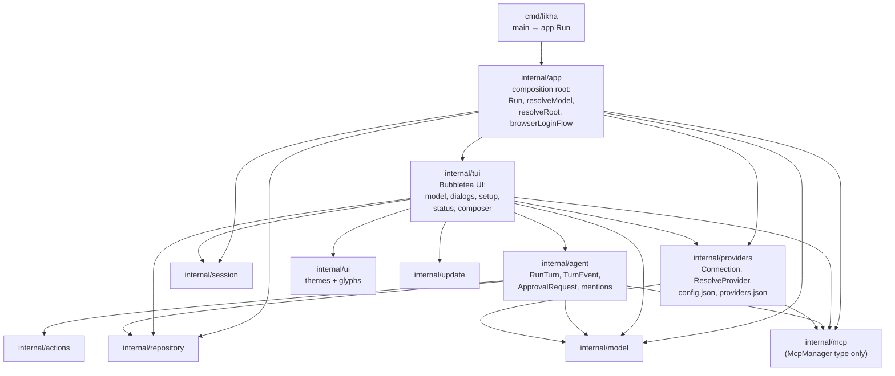

# ARCHITECTURE

One page: which package imports which, what each owns and may not import,
and where the five most likely changes land. Status: implemented (local)
2026-10-01 (structure-refactor Phase 1 + 1.5 + 2).

## Dependency diagram

Rules: no cycles; only `cmd/likha` imports `internal/app`; `agent`
imports no `bubbletea`/`lipgloss`/`tui` (grep-enforced by review, not
lint — depguard is a recorded follow-up); `internal/` stays internal.

## Packages: owns / may-not-import

| Package | Owns | May import | Must never import |
|---|---|---|---|
| `app` | CLI composition: flags, `Run`, model/root resolution, browser login, the single `tea.NewProgram(tui.NewUI(...))` call | `tui`, `providers`, `model`, `session`, `repository`, `mcp`, `ui` | nothing else; no UI logic |
| `tui` | All Bubbletea UI: `ui` struct, `NewUI`, `Update` dispatch, dialogs, setup, status, composer/editor/scroll/popups, `Version`, `logo` | `agent`, `providers`, `model`, `session`, `repository`, `mcp`, `ui`, `update` | `app` (would cycle) |
| `agent` | Turn loop: `RunTurn`, `TurnEvent`/`ApprovalRequest`, `CompactHistory`, `GenerateSessionName`, mention expansion + index helpers | `actions`, `model`, `repository`, `mcp` (manager type only) | `bubbletea`, `lipgloss`, `tui`, `providers` |
| `providers` | Provider identity + persistence: `Connection`, `ResolveProvider`, `SwitchModelID`, `CustomEndpointTarget`, `Load/SaveStoredConfig`, `Store/StoredKey/OAuth`, paths | `model`, `mcp` (manager type only) | `tui`, `agent`, Bubbletea |
| `mcp` | MCP stdio core + `McpManager` (`NewMcpManager`, `Tools`, `Call`, `Stop`, `Status`, `Summary`, `Trusted`, test-only `NewMcpManagerForTest`) | `model` | `tui`, `agent`, `providers`, `app` |
| `ui` | Themes + glyphs (`ThemeNames`, `Resolve`, `HasDarkBackground`, `Ascii/NerdGlyphs`) | `lipgloss` | project packages |
| `model`, `session`, `repository`, `actions`, `update`, `skills` | Unchanged leaf packages (see their package docs) | — | — |

## Where do I add X?

| Change | Home | Notes |
|---|---|---|
| A tool (`read_file` sibling) | `internal/agent/agent.go` (`agentTools` + `dispatchTool` case) + `internal/actions/` if it needs execution logic | Reads run direct; mutations go through `requestApproval` (FR-06/07/08) |
| A provider | `internal/model` (catalog entry) + `internal/providers` if resolution/credential rules change | UI switch flow lives in `tui/providers.go`; key modal stays there |
| A keybinding | `internal/tui/tui.go` `Update` (sole dispatcher) + widget file owning the focus | Delegation order (setup → mention → command → keyModal → dialog → keys) is load-bearing; keep verbatim |
| A status segment | `internal/tui/status_line.go` (render) + `status_sources.go` (data) + `providers.StoredStatusLineConfig` field | Resolve through `providers.FlagEnabled`; tests in `status_line_test.go` |
| A dialog | `internal/tui/dialog.go` (`dialogKind`, open/update/view/confirm) | Slash entry point in `handleCommand`; shared selection modal, one cursor |

## History

- Phase 1 (2026-10-01): `ui/` → `internal/ui`; `statusbar_test.go` → `status_view_test.go`; `internal/skills` retained (custom-commands/text-transforms/slash-commands depend on the path).
- Phase 1.5 (2026-10-01): `tui.go` 2,209 → ~1,000 lines via same-package `setup.go`/`dialog.go`/`view.go` extraction.
- Phase 2 (2026-10-01): `internal/agent`, `internal/providers`, `internal/tui` formed; `app` shrunk to composition; `Version` + `logo` live in `tui` (release.sh ldflags updated, verified).
