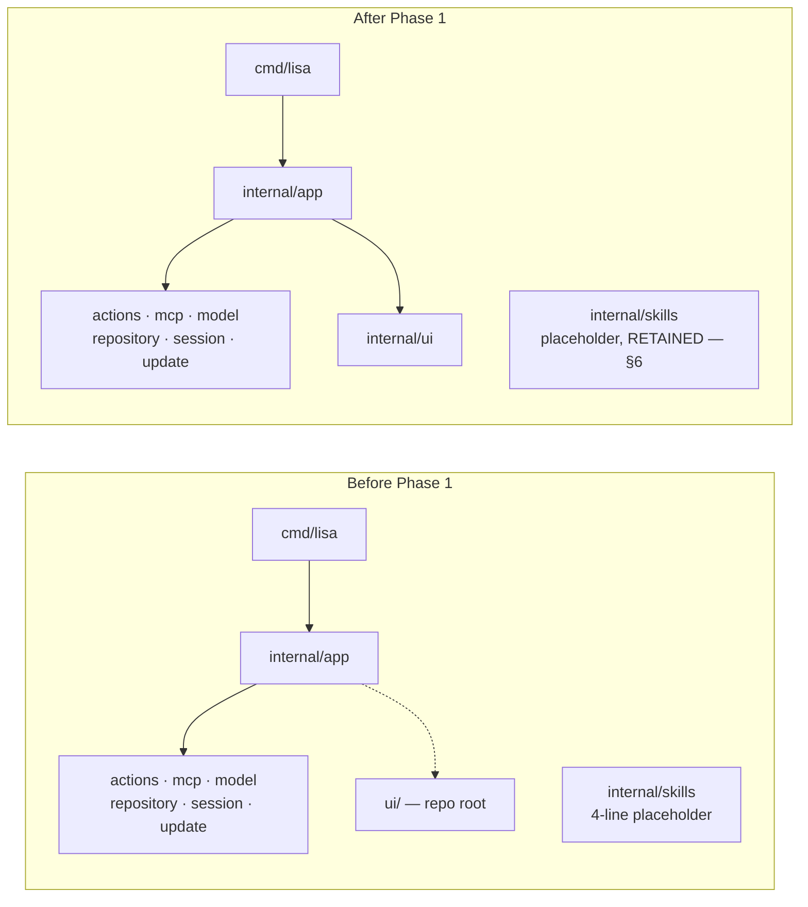

# Phase One Architecture Specification

**Status:** implemented (local) 2026-10-01 · **Scope:** Phase 1 mechanical moves + Phase 1.5 `tui.go` slimming (§11) · **Contract:** zero behavior change

## 0. Role and stance

Principal systems architect. This document is the buildable contract for
Phase 1 of `specs/structure-refactor/spec.md`. It was written after reading
every spec in `specs/` — not just the refactor spec — and that reading
removed one item from Phase 1 (§6). Developer-friendly and user-friendly to a
5/5 standard is the acceptance bar, defined and scored in §7.

## 1. Baseline topology (verified by grep, 2026-09-30)

Module `lisa`. Consumers of the moving pieces:

| Symbol | Files (exact) |
|---|---|
| `lisaui "lisa/ui"` import | `internal/app/run.go:21`, `internal/app/tui.go:23`, `internal/app/status_markers_test.go:10`, `internal/app/tui_muted_tools_test.go:10` |
| `lisaui.*` call sites | `run.go:222`; `tui.go:76-77,184,248-252,412,553,558,898,914,929,1845`; `status_markers_test.go:34-35,63-64`; `tui_muted_tools_test.go:89-90` |
| `internal/skills` importers | none (zero results repo-wide, `.cache` excluded) |
| `statusbar_test.go` (531 lines, 14 tests) | subjects are `tui.go` `ui`-methods (`m.header`, `m.statusTitle`, `m.statusLineRows`, `m.spendSegment`, `m.startTurn`, …), not status files |
| Doc references to moving paths | `specs/update-notification/banner.md:124` (`` `lisa/ui` ``), `specs/tui-layout/context.md:17` (`` `internal/app/statusbar_test.go` ``), `specs/tui-layout/context.md:18` (`` `ui/theme.go` ``) |

## 2. Change inventory (the whole of Phase 1 — nothing else moves)

| # | Change | Files touched | Type |
|---|---|---|---|
| P1-1 | `git mv ui internal/ui` (`glyphs.go` 32 lines, `theme.go` 147 lines + package doc); rewrite the import line in the 4 consumer files to `"lisa/internal/ui"`, dropping the `lisaui` alias (collision pre-verified: no bare `ui.` symbol in scope) | 2 moved, 4 import lines | move |
| P1-2 | `git mv internal/app/statusbar_test.go internal/app/status_view_test.go`; all 14 test function names byte-identical | 1 renamed | move |
| P1-3 | Doc hygiene for the two moves: `banner.md:124` `` `lisa/ui` `` → `` `lisa/internal/ui` ``; `tui-layout/context.md:17` `statusbar_test.go` → `status_view_test.go`; `tui-layout/context.md:18` `ui/theme.go` → `internal/ui/theme.go` | 3 lines in 2 docs | edit |
| — | `internal/skills` deletion | **REMOVED from scope — see §6** | — |
| — | `tui_m2_keys_test.go` rename | **deferred to Phase 2** (owning feature `tool-rendering-terminal-keys` is `in progress`; rename rides with its checklist as originally specified) | — |

## 3. Component descriptions

- **`internal/ui` (after P1-1).** Presentation leaf: `theme.go` (seven style
  roles, `ThemeNames`/`Resolve`/`HasDarkBackground`/`Named`,
  `AsciiGlyphs`/`NerdGlyphs`) and `glyphs.go` (`Glyphs`: Waiting/Working/
  Review markers). Imports only `lipgloss`. Imported only by the TUI layer.
  The `internal/` home makes the "no public API surface" invariant true:
  after this move every project package lives under `internal/`.
- **The four consumers.** `run.go` (theme-name validation at startup),
  `tui.go` (theme/glyph state + resolution), `status_markers_test.go` and
  `tui_muted_tools_test.go` (theme × glyph matrix assertions for FR-15).
  All four change by exactly one import line each; every `lisaui.X` call
  site becomes `ui.X` with identical resolution.
- **`internal/skills` (retained).** 4-line inert placeholder. It is the
  explicitly named anchor for two draft specs (§6); its cost is 4 lines and
  its removal cost is Camille: three specs' ground truth. Retention is the
  architecture decision.
- **`internal/app/status_view_test.go` (after P1-2).** The 14 view-behavior
  tests (`TestHeaderCollapsesToFiftySixColumns`, `TestLogoEntryIsPureLogo`,
  `TestLisaMarkPlacementAndRetirement`, `TestContextSegmentFormats`, …)
  finally named after what they exercise. `status_markers_test.go` (3
  marker/theme-contract tests) keeps its accurate name; its import line
  changes per P1-1 only.

## 4. Non-goals (binding)

No function-body change; no signature/export change; no new package besides
`internal/ui` (a relocation, not an invention); no FR wording change; no
`main.go`/`run.go` logic change; no test logic, name, or assertion change;
`slices` of `internal/app` untouched — the `tui.go` slimming and any
`agent`/`providers`/`tui` split belong to Phase 2 and are not pre-authorized
here.

## 5. Cross-spec compliance trace

| Spec | Disposition | Verdict |
|---|---|---|
| `structure-refactor/spec.md` Phase 1 §1 (ui move), §3 as amended (rename, not merge — per its own `context.md` mapping key) | P1-1, P1-2 implement exactly | ✅ comply |
| `structure-refactor/spec.md` Phase 1 §2 (skills deletion), `tasks.md` task 3, `checklist.md` skills item | **Superseded by §6**; amendment text in §9 | ⚠️ amend (this doc is the amendment record) |
| `specs/README.md` conventions (spec-per-feature, no checkmarks in planning docs, `go test ./...` entry point) | This doc adds no checkboxes; gates cite the entry point | ✅ comply |
| `custom-commands/spec.md` ("activates the reserved-but-inert `internal/skills` package"), `custom-commands/context.md` (placeholder row) | Placeholder path preserved | ✅ comply |
| `text-transforms/context.md` (transforms "load through" the skills placeholder; "must not create a parallel loader") | Placeholder path preserved; no loader created | ✅ comply |
| `slash-commands/spec.md` + `role.md` (`/skills` placeholder, "Do not implement `/skills`") | Reservation untouched, still inert | ✅ comply |
| `tui-layout/context.md` (paths to `statusbar_test.go`, `ui/theme.go`) | P1-3 keeps both references resolvable | ✅ comply |
| `update-notification/banner.md:124` (`` `lisa/ui` `` roles) | P1-3 keeps the reference resolvable | ✅ comply |
| `tool-rendering-terminal-keys` (`in progress`; owns `tui_muted_tools_test.go`, `tui_m2_keys_test.go`) | Muted-tools test changes by one import line only; M2 file untouched; its checklist stays the authority | ✅ comply |
| `v1-spec.md` FR-03/04/06/07/08/10/12/14/15/16/17 | No FR touched; FR-15 marker suites and `approval_test.go` are the oracles | ✅ comply |
| `feature-test-plan.md` smoke | Behavior identical ⇒ smoke steps valid unchanged | ✅ comply |

## 6. Conflict found and resolved (the one deviation that isn't one)

**Conflict:** `structure-refactor` orders deletion of `internal/skills`;
`custom-commands` (spec + context), `text-transforms` (context), and
`slash-commands` (spec + role) jointly depend on that exact path existing
as the inert placeholder.

**Resolution:** the placeholder stays. Precedent and cost decide it: three
specs' ground truth outweighs one spec's tidiness item; the file is 4
lines with zero importers and zero build cost; deletion would force
amendments across two draft features and their shared-loader dependency
for no behavioral or structural gain. This document supersedes the
deletion items (§9 records the exact amendment). The prompt template's
"No conflicts identified" is therefore overruled by evidence — reported
here, not hidden.

## 7. Five-out-of-five criteria and how Phase 1 scores them

**Developer-friendly (5/5):**

1. **One obvious home per concern** — `internal/` holds every project
   package; no root-level package to explain to a newcomer. (P1-1)
2. **Names that match subjects** — `status_view_test.go` exercises view
   methods; no more `statusbar_*` file with no `statusbar.go` source.
   A `grep` for a symbol lands on the file that owns it. (P1-2)
3. **Docs that resolve** — every path a spec cites exists after the move;
   no `banner.md`/`context.md` reference rots on landing day. (P1-3)
4. **Reviewable diff** — moves only; a reviewer verifies with `git diff`
   move detection, not by re-reading logic. (§8 gate)
5. **No forward debt** — nothing Phase 2 must undo; retained placeholder
   keeps draft features' ground truth intact. (§6)

**User-friendly (5/5):**

1. **Zero visible change** — no string, color, keybinding, or flow changes;
   the TUI is pixel-identical. (§4)
2. **Theme/marker contract pinned** — FR-15 suites (`status_markers`,
   muted-tools) run green on the moved package. (§8)
3. **Approval safety untouched** — FR-06/07/08 paths unmodified;
   `approval_test.go` green unmodified. (§8)
4. **No new failure modes** — no new imports, no new packages with
   behavior, no init-order or lifecycle change.
5. **Release story unchanged** — smoke steps and install docs valid
   without a word changed.

## 8. Verification gates (binding, in order)

- **Precondition:** tree clean — commit or stash in-flight work first
  (audit observed modifications to `tui.go`, `scroll.go`,
  `scroll_test.go`, `composer.go`, `status_line*.go` plus untracked
  `status_markers_test.go`; re-verify at execution). Capture baselines:
  `go build ./...`, `go vet ./...`, `go test ./...`,
  `go test -race ./...`, `gofmt -l .`, `go list ./...`.
- **Per change:** `go build ./...` green after P1-1, after P1-2.
- **Exit gate:** full baseline suite green + `gofmt -l` clean +
  `grep -rn 'lisa/ui' --include='*.go' .` empty +
  `go list ./...` shows `lisa/internal/ui`, no `lisa/ui` +
  `git diff` move-detection audit shows moves + 4 import lines + 3 doc
  lines, zero function-body changes. Only then `implemented (local)`.

## 9. Amendments this document records (to apply when Phase 1 lands)

1. `spec.md` Phase 1 §2 → struck; replaced by: "`internal/skills` is
   retained as the inert placeholder owned by `custom-commands`; see
   `architecture-phase-1.md` §6."
2. `tasks.md` task 3 → struck; replaced by: "Verify `internal/skills` has
   zero importers and leave it in place (`go list ./...` still shows it)."
3. `checklist.md` skills item → replaced by: "`go list ./...` still shows
   `lisa/internal/skills`; `/skills` reservation behavior unchanged."
4. `checklist.md` Phase 1 gate → append P1-3 doc-line updates to the diff
   audit (moves + 4 import lines + 3 doc lines).

## 10. Execution checklist

- [x] All specifications addressed (§5 traces 11 specs/decisions).
- [x] Architecture presented in Markdown (this file).
- [x] Diagrams and component details included (§1 diagram; §3 components).
- [x] Compliance with the 5-out-of-5 criteria shown criterion-by-criterion (§7).
- [x] Conflict surfaced and resolved with evidence, not hidden (§6).
- [x] Practical for a dev team: exact files, lines, commands, gates (§1, §2, §8).

## 11. Amendment 2026-09-30 — Phase 1.5: slim `tui.go` in place (user-confirmed)

Decision (user-confirmed 2026-09-30): `tui.go` (2,209 lines, symbol roster
verified same day) is slimmed by **same-package widget extraction**, not by
the `internal/agent` / `internal/providers` / `internal/tui` package split.
Reasons: the next-largest file in the package is `status_line.go` at 451
lines — the smell is one file, not the package; the package already reads as
a map (`run` = composition, `agent` = turn loop, `composer`/`editor`/`scroll`/
`commandcomplete` = input widgets, `status_*` = footer, `provider`/`keyfile`/
`config` = settings); `connection` is genuinely shared state whose split
would force 10+ field exports for zero behavior gain; and one importer means
a hypothetical seam. The package split stays parked until a second consumer
(e.g. headless CLI) actually needs the turn loop without Bubbletea.

Target shape (same package `app`, four files, moves only — no signature,
export, or behavior change):

| New file | Receives from `tui.go` (line ranges, inclusive) | Owns |
|---|---|---|
| `setup.go` (~230 lines) | `setupState` + setup consts (40-64), `updateSetup` (323-436), `setupWindow` (438-441), `startSetupCheck` (443-453), `setupCheckMsg` (455-461), `openBrowser` (463-473), `startOAuthLogin` (475-484), `oauthLoginMsg` (486-492), `finishSetup` (494-547), `applySetupTheme` (549-568), `setupView` (1776-1775→actual), `setupLines` (1808-1872), `setupActions` (1874-1891) | first-run setup: state machine, OAuth/device flow, all setup rendering |
| `dialog.go` (~330 lines) | `dialogKind` + consts (134-147), `dialogState` + doc (149-162), `dialogMatches` (164-175), `openDialog` (177-241), `newUI` stays in `tui.go`, `updateDialog` (782-836), `dialogWindow` (838-843), `confirmDialog` (845-891), `handleCommand` (672-729) + `handleSessionsCommand` (731-750) + `resumeSession` (752-780), `dialogView` (1905-2040), `dialogLabel` (2094-2112), `dialogKindName` (2114-2128), `windowList` (1893-1903) if dialog-only (verify: also used by setup view — if shared, stays in `tui.go`) | selection dialogs + slash-command dispatch |
| `view.go` (~330 lines) | `entry` (65), `header` (1609-1614), `bodyHeight` (1616-1618), `pageCount` (1620-1631), `rebuild` (1633-1709), `View` (1711-1732), `mainView` (1734-1774), `markReviewPage` (1599-1607), `frame` (2130-2142), `wrap` (2144-2178), `fit` (2184-2192), `hiddenReviewRune` (2180-2182), `dimRow`/`spliceRow`/`stripANSI`/`splitAtWidth` (2042-2092), `fitHint` (status-adjacent — verify callers; moves only if view-only) | transcript assembly + layout + row helpers |
| `tui.go` (~1,300 lines, still the owner) | keeps: `ui` struct (67-132) + layout consts (`minWidth/minHeight`, `contentWidth`, `modeMain/modeSetup`), `newUI` (243-292), `Init` (300-321), `Update` (1009-1510, the sole dispatcher — delegation call sites at 1281/1286/1293/1300/1303 stay verbatim), `startTurn` (575-628), `startCompaction` (630-665), `editable`/`syncPopups` (1513-1565), `escDecay` consts + `escDecay()` (1547-1555), `autoNameAfterFirstTurn` + `nameGeneratedMsg` (1557-1579), `persist` (1581-1597), `waitEvent` (570-573), `updateAvailableMsg` (294-297), `commandHelp` (667-670), model/session/theme/provider handlers that are turn-or-app wiring not dialog/setup/view (`handleModelsResult`, `applyModel`, `handleThemesCommand` + `applyTheme`, `updateSegment`-adjacent state stays where it is) | model root: state, constructor, message dispatch, turn lifecycle |

Sequencing (each step leaves `go build ./...` green; test files do NOT move
in Phase 1.5 — they keep testing the same package):

1. `setup.go` first — cleanest cut (setup consts + `setupState` + setup
   methods + setup views; only inbound edge is `Update`'s
   `modeSetup → updateSetup` delegation).
2. `dialog.go` second — dialog state + `updateDialog`/`dialogView` +
   command dispatch travel together because `handleCommand` opens dialogs
   and `confirmDialog` applies their results; splitting them across steps
   would break the build mid-flight.
3. `view.go` last — pure render; verified by the full view/assertion
   suites without touching dispatch.

Rules: whole-function moves only (`CUT` + paste, zero body edits);
line-range drift is resolved by symbol name, not number; shared helpers
(`windowList`, `fitHint`) move only if all callers move with them —
otherwise they stay in `tui.go`; Update's delegation order
(setup → mention → command → keyModal → dialog → composer-key routing)
is load-bearing per `tool-rendering-terminal-keys/role.md` and stays
verbatim; `slash-commands`, `first-run-setup`, `conversation-compaction`
checklists are the oracles for dispatch, setup, and compaction paths.

Exit gate: `go build ./...`, `go vet` on project trees, `go test ./...`
(modulo the two recorded pre-existing logo-asset failures),
`go test -race` on dialog/setup/view suites, `gofmt -l` clean on the four
touched files, and a size audit — no file over ~600 lines except `tui.go`
itself (target ≤ ~1,300). Status `implemented (local)` for Phase 1.5 only
after this gate.
